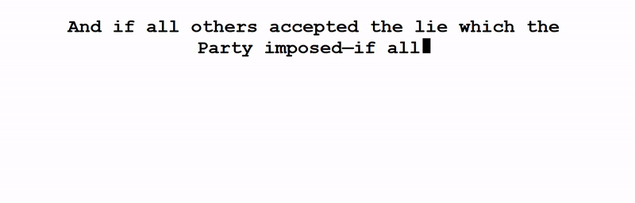

# TypeWriter Web Component

Use TypeWriter-Text on your website with only two lines of html-code

## Simple Usage Example

1. Copy type-writer.js (./bundled-dist/type-writer.js) to your working directory
2. In the head area of your .html insert `` 
3. In the body of your .html add `<type-writer quotes='[{"author": "Test Author", "content": "Hello World"}]'></type-writer>`

For more complex example including asynchronously loading quotes see bundled-dist/index.html
